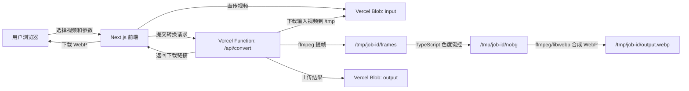

# Web App 方案设计：视频转透明 WebP

状态：方案自审通过，允许进入执行文档。

## 1. 背景与目标

当前根目录脚本已经把主路径切到绿幕/蓝幕色度键控：

- `video2webp.sh`：提取视频帧，调用 `chroma_key.py`，再合成 WebP。
- `chroma_key.py`：只依赖 `numpy` 和 `Pillow`，不依赖 U2-Net 模型。
- `black` 模式仍保留 `backgroundremover`，但本阶段明确不支持。

本阶段目标是做一个方便同事使用的 Web App：

- 同事打开网页即可上传视频并下载透明 WebP。
- 第一版只支持 `auto`、`green`、`blue` 三种背景模式。
- 不要求用户安装 Python、ffmpeg、img2webp 或模型文件。
- 代码和文档全部放在 `web-app/` 目录。

## 2. 关键结论

推荐做 **Next.js + Vercel Blob + Vercel Function**。

不推荐直接把视频 POST 到普通 API Route。Vercel 官方限制写明：Vercel Function 的 request body 和 response body 最大载荷均为 4.5 MB，超过会返回 `413 FUNCTION_PAYLOAD_TOO_LARGE`。视频文件很容易超过这个限制。

因此第一版必须走 Vercel Blob：

1. 浏览器把视频直传到 Vercel Blob。
2. Vercel Function 收到 Blob URL 后下载视频到 `/tmp`。
3. Function 在 `/tmp` 内提帧、色度键控、合成 WebP。
4. Function 把 WebP 上传回 Vercel Blob。
5. 浏览器拿到下载链接。

官方依据：

- Vercel Functions 限制：<https://vercel.com/docs/functions/limitations>
- Vercel Functions runtime 文件系统：<https://vercel.com/docs/functions/runtimes>
- Vercel Blob server upload 与 client upload 说明：<https://vercel.com/docs/vercel-blob/server-upload>

## 3. MVP 范围

### 支持

- 输入格式：`.mp4`、`.mov`
- 背景模式：`auto`、`green`、`blue`
- 输出格式：透明背景 animated WebP
- 参数：
  - 背景模式
  - 输出质量，默认 85
  - 最大处理帧率，默认 24fps，可选 15fps、24fps、30fps
  - 最大输出边长，默认 720px
- 转换完成后提供 WebP 下载链接。

### 暂不支持

- `black` 模式
- 普通自然背景去除
- 白底、红底等非绿/蓝幕背景
- 批量任务
- 长时间后台队列
- 登录、权限、多用户历史记录
- 精细调参界面，例如 `low/high/band/no-choke`

## 4. 使用限制

第一版限制必须保守，否则容易被 Vercel Function 的临时磁盘、内存和执行时间限制卡住。

建议硬限制：

| 项目 | MVP 限制 | 原因 |
|---|---:|---|
| 输入视频大小 | 50 MB | Blob 可承接大文件，但 Function 仍要下载、解码、处理 |
| 视频时长 | 8 秒 | 控制帧数和执行时间 |
| 最大处理帧率 | 24fps 默认，30fps 高质量模式 | 控制 PNG 中间帧数量，30fps 更流畅但更耗时 |
| 最大输出边长 | 720px | 控制单帧内存和最终 WebP 大小 |
| 输出 WebP | 20 MB 以内为目标 | 方便浏览器下载和同事转发 |
| 并发任务 | 单个 Function 单任务 | 避免抢 CPU、内存和文件描述符 |

如果同事的素材经常超过这些限制，Vercel Function 就不是最终形态，需要改为专门的转码服务，例如 Cloud Run、Render、Fly.io、ECS 或本地桌面版。

## 5. 系统架构



## 6. 技术选型

### 前端

- Next.js App Router
- React Client Component 实现上传、参数选择、进度状态和结果下载
- 使用原生控件，不引入复杂 UI 组件库

### 后端

- Next.js Route Handler：`src/app/api/convert/route.ts`
- Node.js runtime，不使用 Edge runtime
- `maxDuration` 设置为 300 秒
- 临时文件全部写入 `/tmp`
- 每个任务生成独立 `jobId` 目录，完成后清理

### 视频处理

优先方案：

- 使用 `@ffmpeg-installer/ffmpeg` 提供 ffmpeg 二进制。
- 用 ffmpeg 提帧为 PNG。
- 用 TypeScript 移植 `chroma_key.py` 的核心算法。
- 用 ffmpeg 合成 animated WebP。

备选方案：

- 如果 `@ffmpeg-installer/ffmpeg` 在 Vercel bundle 体积或运行环境上失败，再把处理服务迁到 Cloud Run。

不采用：

- `ffmpeg.wasm` 纯前端处理。原因是视频解码和 WebP 编码都在浏览器内完成，大文件性能、内存和兼容性风险更高。
- Python Serverless Function。原因是当前目标是 Vercel + Next.js 一体部署，Node.js 更贴合 Vercel Blob SDK 和 App Router。

## 7. API 设计

### `POST /api/upload`

用于 Vercel Blob client upload 的 token 交换。

职责：

- 限制上传类型为 `video/mp4`、`video/quicktime`。
- 限制文件大小为 50 MB。
- 生成 Blob 上传 token。

### `POST /api/convert`

请求体：

```json
{
  "inputUrl": "https://...",
  "inputPathname": "inputs/example.mov",
  "filename": "example.mov",
  "mode": "auto",
  "quality": 85,
  "maxFps": 15,
  "maxSize": 720
}
```

响应体：

```json
{
  "outputUrl": "https://...",
  "outputPathname": "outputs/example.webp",
  "sizeBytes": 1234567,
  "frames": 120,
  "durationMs": 67
}
```

错误响应：

```json
{
  "error": "未检测到绿幕或蓝幕，请选择 green 或 blue 后重试"
}
```

## 8. 数据与文件生命周期

- 输入视频上传到 Blob 的 `inputs/` 前缀。
- 输出 WebP 上传到 Blob 的 `outputs/` 前缀。
- 转换完成后立即删除输入视频，防止 Blob 文件堆积。
- 惰性清理：每次转换时扫描 `outputs/`，删除超过 1 小时的旧 WebP。
- `/tmp/job-id/` 只保存处理期间的中间文件，`finally` 块确保清理。

## 9. 错误处理

前端展示明确错误，不显示堆栈：

- 文件过大：提示压缩或裁剪到 50 MB 内。
- 时长过长：提示裁剪到 8 秒内。
- 背景检测失败：提示改选 `green` 或 `blue`，复杂背景暂不支持。
- 转换超时：提示降低分辨率、帧率或时长。
- Vercel Blob 未配置：提示检查 `BLOB_READ_WRITE_TOKEN`。

后端日志保留技术细节：

- ffmpeg 命令退出码
- stderr 前 2000 字符
- jobId
- 输入文件名、模式、帧率、输出大小

## 10. 安全与隐私

- 不接收远程任意 URL，只处理前端通过 Vercel Blob 上传得到的 URL。
- 文件名只用于展示，服务端内部使用 `jobId`，避免路径穿越。
- 限制 MIME type 和扩展名。
- 第一版无登录，所以链接拥有者可访问 Blob 文件；如果同事素材敏感，需要后续加登录或改为私有 Blob + 短期下载 URL。

## 11. 部署要求

Vercel 侧要求：

- 创建 Vercel Blob Store（`vercel blob create-store video2webp --access public --yes`）。
- 让项目获得 `BLOB_READ_WRITE_TOKEN`。
- 使用 Node.js runtime。
- 设置 `maxDuration` 为 300 秒。
- Hobby 计划 Function 内存上限 2048 MB（`vercel.json` 中配置）。
- `next.config.ts` 需配置 `outputFileTracingIncludes`，确保 ffmpeg 二进制被包含在部署包中。
- 确认 Function bundle 未超过 Vercel 限制。

本地开发要求：

- Node.js 20+ 或 22+
- npm
- `vercel env pull` 拉取 Blob token 到 `.env.local`

## 12. 主要风险

| 风险 | 影响 | 应对 |
|---|---|---|
| ffmpeg 二进制在 Vercel 不可用 | 无法提帧或合成 | 已通过 `outputFileTracingIncludes` + `serverExternalPackages` 解决 |
| Function `/tmp` 空间不足 | 中途失败 | 限制 50 MB、8 秒、720px、24fps 默认，30fps 作为高质量模式 |
| 输出 WebP 过大 | 上传慢、下载慢 | 限制质量和帧率，必要时增加输出大小校验 |
| 转换超过 maxDuration | 504 | 限制素材长度，后续改异步队列 |
| Blob 文件积累 | 成本增长 | 已实现输入即时删除 + 输出惰性清理（超 1 小时自动删），无需人工干预 |

## 13. 自审

自审时间：2026-06-11

| 检查项 | 结果 | 说明 |
|---|---|---|
| 是否仍包含 black 模式 | 通过 | 明确列为暂不支持 |
| 是否绕开 4.5 MB 普通 API 上传限制 | 通过 | 方案采用 Vercel Blob client upload |
| 是否说明 Vercel 资源限制 | 通过 | 覆盖 request/response、`/tmp`、duration、bundle 风险 |
| 是否过度设计 | 通过 | 不做账号、队列、历史记录、批量任务 |
| 是否能让同事实际使用 | 通过 | 浏览器上传、转换、下载闭环成立 |
| 是否给后续执行留下明确边界 | 通过 | 文件、API、限制、错误处理均已定义 |

自审结论：方案可以进入执行文档。执行时不得把 `black` 模式、复杂背景、批量队列加入第一版。
